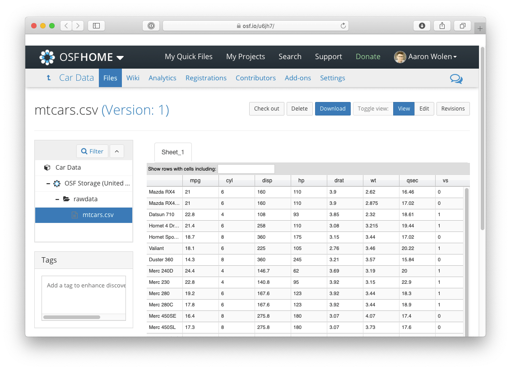

<!-- README.md is generated from README.Rmd. Please edit that file -->

# osfr <a href="https://docs.ropensci.org/osfr/"></a>

<!-- badges: start -->

[](https://CRAN.R-project.org/package=osfr)
[](https://github.com/ropensci/osfr/actions/workflows/R-CMD-check.yaml)
<!-- badges: end --> [](https://codecov.io/github/ropensci/osfr?branch=master)
[](https://github.com/ropensci/software-review/issues/279)
[](https://doi.org/10.21105/joss.02071)
[](https://zenodo.org/badge/latestdoi/42329785)

## Overview

osfr provides a suite of functions for interacting with the Open Science
Framework ([OSF](https://osf.io "Open Science Framework")).

**What is OSF?**

*OSF is a free and [open
source](https://github.com/CenterForOpenScience/osf.io "OSF's GitHub Repository")
project management repository designed to support researchers across
their entire project lifecycle. The service includes unlimited cloud
storage and file version history, providing a centralized location for
all your research materials that can be kept private, shared with select
collaborators, or made publicly available with citable DOIs.*

## Installation

You can install the current release of osfr from CRAN (*recommended*):

``` r
install.packages("osfr")
```

Or the development version from GitHub with the *remotes* package:

``` r
# install.packages("remotes")
remotes::install_github("ropensci/osfr")
```

## Usage Examples

*Note: You need to [setup an OSF personal access token
(PAT)](https://docs.ropensci.org/osfr/articles/auth) to use osfr to
manage projects or upload files.*

### Accessing Open Research Materials

Many researchers use OSF to archive and share their work. You can use
osfr to explore publicly accessible projects and download the associated
files—all you need to get started is the project’s URL or GUID (global
unique identifier).

Every user, project, component, and file on OSF is assigned a GUID that
is embedded in the corresponding entity’s URL. For example, you can
access the main OSF project for the *Cancer Reproducibility Project* at
<https://osf.io/e81xl/>. The GUID for this project is `e81xl`.

We can then use osfr to *retrieve* this project and load it into R by
providing the GUID:

``` r
library(osfr)

cr_project <- osf_retrieve_node("e81xl")
cr_project
#> # A tibble: 1 × 3
#>   name                                    id    meta            
#>   <chr>                                   <chr> <list>          
#> 1 Reproducibility Project: Cancer Biology e81xl <named list [3]>
```

This returns an `osf_tbl` object with a single row representing the
retrieved project. Let’s list the files that have been uploaded to this
project.

``` r
osf_ls_files(cr_project)
#> # A tibble: 4 × 3
#>   name                                        id                    meta        
#>   <chr>                                       <chr>                 <list>      
#> 1 papers_and_keywords.xlsx                    553e671b8c5e4a219919… <named list>
#> 2 Full_dataset_of_papers_formatted.xls        553e671b8c5e4a219919… <named list>
#> 3 METHOD_to_select_papers.txt                 553e671b8c5e4a219919… <named list>
#> 4 Adjustment of 50 studies to 37 studies.docx 565602398c5e4a3877d7… <named list>
```

This returns another `osf_tbl` with 1 row for each of the files and
directories in the project. We can examine any of these files directly
on OSF with `osf_open()`, which opens the corresponding file’s view in
your default browser.

This project contains 2 ***components***: *Replication Studies* and
*Data collection and publishing guidelines*. We can list these
components with osfr using `osf_ls_nodes()`.

``` r
osf_ls_nodes(cr_project)
#> # A tibble: 5 × 3
#>   name                                                        id    meta        
#>   <chr>                                                       <chr> <list>      
#> 1 Meta-analysis paper figures and tables                      squy7 <named list>
#> 2 Replication Data from the Reproducibility Project: Cancer … e5nvr <named list>
#> 3 Process paper figures and reported statistics               35ut8 <named list>
#> 4 Replication Studies                                         p7ayb <named list>
#> 5 Data collection and publishing guidelines                   a5imq <named list>
```

osfr is compatible with the [pipe
operator](https://magrittr.tidyverse.org) and
[dplyr](https://dplyr.tidyverse.org), providing a powerful set of tools
for working with `osf_tbl`s. Here, we’re listing the sub-components
nested within the *Replication Studies* component, filtering for a
specific study ([*Study 19*](https://osf.io/7zqxp/)) and then listing
the files uploaded to that study’s component.

``` r
library(dplyr)

cr_project %>%
  osf_ls_nodes() %>%
  filter(name == "Replication Studies") %>%
  osf_ls_nodes(pattern = "Study 19") %>%
  osf_ls_files()
#> # A tibble: 6 × 3
#>   name                                      id                      meta        
#>   <chr>                                     <chr>                   <list>      
#> 1 Replication_Study_19.Rmd                  578e2b23594d9001f48164… <named list>
#> 2 Study_19_Correction_Letter.docx           5a56569125719b000ff28b… <named list>
#> 3 Replication_Study_19.docx                 57c9e8ed594d9001e7a240… <named list>
#> 4 Response_letter_Replication_Study_19.docx 58755747b83f6901ff066a… <named list>
#> 5 Replication_Study_19_track_changes.docx   581a27b76c613b02233228… <named list>
#> 6 Replication_Study_19_track_changes_2.docx 58714d46594d9001f801f4… <named list>
```

We could continue this pattern of exploration and even download local
copies of project files using `osf_download()`. Or, if you come across a
publication that directly references a file’s OSF URL, you could quickly
download it to your project directory by providing the URL or simply the
GUID:

``` r
osf_retrieve_file("https://osf.io/btgx3/") %>%
  osf_download()
#> # A tibble: 1 × 4
#>   name                  id    local_path              meta            
#>   <chr>                 <chr> <chr>                   <list>          
#> 1 Study_19_Figure_1.pdf btgx3 ./Study_19_Figure_1.pdf <named list [3]>
```

### Managing Projects

You can use osfr to [create
projects](https://docs.ropensci.org/osfr/reference/osf_create), [add
sub-components](https://docs.ropensci.org/osfr/reference/osf_create) or
[directories](https://docs.ropensci.org/osfr/reference/osf_mkdir), and
[upload files](https://docs.ropensci.org/osfr/reference/osf_upload). See
[Getting
Started](https://docs.ropensci.org/osfr/articles/getting_started) to
learn more about building projects with osfr, but here is a quick
example in which we:

1.  Create a new project called *Motor Trend Car Road Tests*
2.  Create a sub-component called *Car Data*
3.  Create a directory named *rawdata*
4.  Upload a file (`mtcars.csv`) to the new directory
5.  Open the uploaded file on OSF

``` r
# create an external data file
write.csv(mtcars, "mtcars.csv")

osf_create_project(title = "Motor Trend Car Road Tests") %>%
  osf_create_component("Car Data") %>%
  osf_mkdir("rawdata") %>%
  osf_upload("mtcars.csv") %>%
  osf_open()
```



## Details on `osf_tbls`

There are 3 main types of OSF entities that osfr can work with:

1.  **nodes:** both
    [projects](https://help.osf.io/article/383-creating-a-project "OSF: Create a Project")
    and
    [components](https://help.osf.io/article/253-create-components "OSF: Create a Component")
    (i.e., sub-projects) are referred to as nodes
2.  **files:** this includes both files *and* folders stored on OSF
3.  **users:** individuals with OSF accounts

osfr represents these entities within `osf_tbl`s—specialized data frames
built on the tibble class that provide useful information about the
entities like their `name` and unique `id` for users, and API data in
the `meta` column that’s necessary for osfr’s internal functions.
Otherwise, they’re just `data.frames` and can be manipulated using
standard functions from base R or dplyr.

## Acknowledgments

OSF is developed by the [Center for Open
Science](https://www.cos.io "Center for Open Science") in
Charlottesville, VA.

The original version of osfr was developed by [Chris
Chartgerink](https://github.com/chartgerink) and further developed by
[Brian Richards](https://github.com/bgrich) and [Ryan
Hafen](https://github.com/hafen). The current version was developed by
[Aaron Wolen](https://github.com/aaronwolen) and is *heavily* inspired
by [Jennifer Bryan](https://github.com/jennybc) and [Lucy D’Agostino
McGowan](https://github.com/lucymcgowan)’s excellent
[googledrive](https://googledrive.tidyverse.org) package. Seriously, we
borrowed a lot of great ideas from them. Other important resources
include [http testing](https://books.ropensci.org/http-testing/) by
Scott Chamberlain and [R Packages](https://r-pkgs.org) by Hadley
Wickham. Development was also greatly facilitated by OSF’s excellent
[API documentation](https://developer.osf.io "OSF API Documentation").

Big thanks to Rusty Speidel for designing our logo and [Tim
Errington](https://github.com/timerrington) for his feedback during
development.

## Contributing

Check out the [Contributing
Guidelines](https://github.com/ropensci/osfr/blob/master/.github/CONTRIBUTING.md)
to get started with osfr development and note that by contributing to
this project, you agree to abide by the terms outlined in the
[Contributor Code of
Conduct](https://github.com/ropensci/osfr/blob/master/.github/CODE_OF_CONDUCT.md).

[](https://ropensci.org)

<!-- links -->
